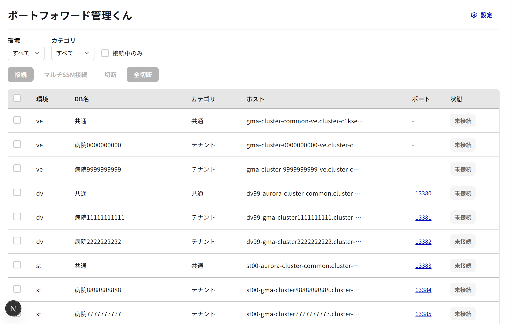
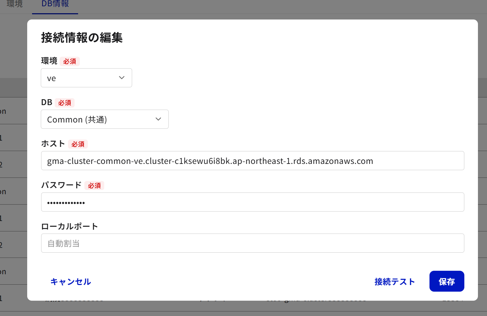
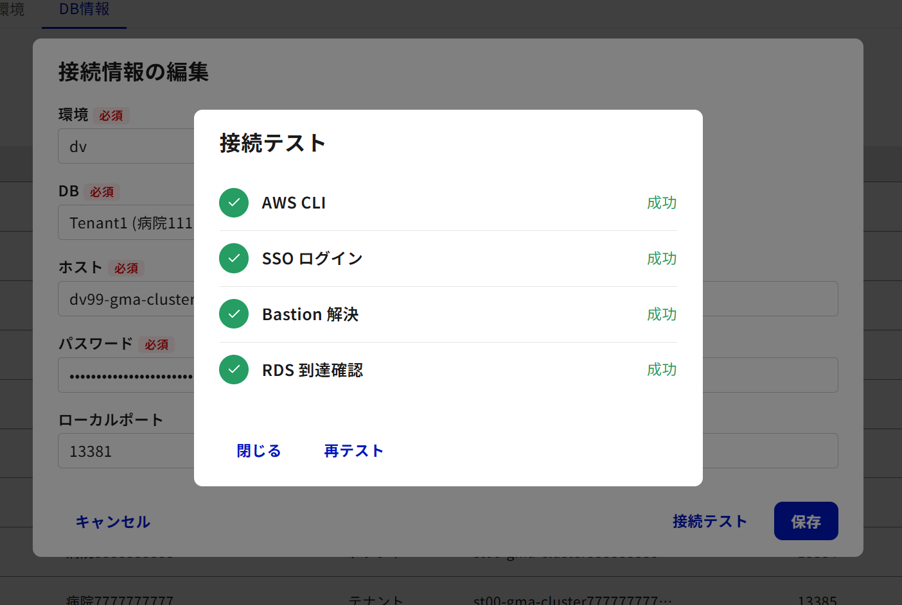

# portforward-kun (ポートフォワード管理くん)

AWS SSM経由のRDSポートフォワーディングをGUIで管理するデスクトップWebアプリ。
複数環境(dev/stg/prod)のRDSへの接続をワンクリックで確立・管理できます。



## 主な機能

- **トンネル管理** — SSMポートフォワーディングの接続・切断をワンクリックで操作
- **マルチ環境対応** — public(直接接続) / private(SSM経由) を環境ごとに切り替え
- **接続テスト** — AWS CLI → SSO → Bastion → RDS の4ステップ検証
- **マルチSSM接続** — 1つのDBに対して複数ポートフォワードを同時起動
- **設定管理** — 環境・DB・接続情報をGUIから編集
- **リアルタイムログ** — バックエンド操作のログをブラウザ上で確認

| 接続情報の編集 | 接続テスト |
|:---:|:---:|
|  |  |

## 前提条件

- AWS CLI v2
- AWS SSO 設定済み
- Python 3.10+
- Node.js 18+
- pnpm

## クイックスタート

### 1. リポジトリをクローン

```bash
git clone https://github.com/<your-org>/portforward-kun.git
cd portforward-kun
```

### 2. 設定ファイルを準備

```bash
cp db_env_config.example.json db_env_config.json
```

`db_env_config.json` を開いて、自分の環境に合わせて編集してください（SSO URL、アカウントID、RDSホスト、パスワード等）。

### 3. 起動

**ワンクリック起動（Windows）:**

`start.bat` をダブルクリック。初回は依存パッケージのインストールも自動で行います。

**手動起動:**

```bash
# バックエンド
pip install -r requirements.txt
python -m uvicorn backend.main:app --reload --port 18080

# フロントエンド（別ターミナル）
cd frontend
pnpm install
pnpm dev
```

ブラウザで http://localhost:18081 にアクセス。

### 停止

`stop.bat` をダブルクリック、または各ターミナルで `Ctrl+C`。

## 技術スタック

| レイヤー | 技術 |
|---------|------|
| Frontend | Next.js 16 / React 19 / TypeScript / Tailwind CSS 4 |
| 状態管理 | Zustand + SWR |
| Backend | Python FastAPI / Uvicorn |
| インフラ連携 | AWS CLI (subprocess) / SSM / SSO |
| Lint / Format | Biome |

## ディレクトリ構成

```
portforward-kun/
├── frontend/              # Next.js フロントエンド
│   ├── src/
│   │   ├── app/           # App Router (layout, page)
│   │   ├── components/    # UIコンポーネント
│   │   │   ├── ui/        # 汎用プリミティブ (Button, Table, Dialog, etc.)
│   │   │   └── dialogs/   # 各種ダイアログ
│   │   ├── hooks/         # カスタムフック (useConfig, useTunnels, etc.)
│   │   ├── stores/        # Zustand ストア
│   │   └── lib/           # 型定義, APIクライアント
│   └── next.config.ts     # APIプロキシ設定
├── backend/               # Python FastAPI バックエンド
│   ├── core/              # ビジネスロジック
│   │   ├── aws_db_tunnel.py      # AWS SSMトンネル管理
│   │   ├── connection_manager.py # 接続状態管理
│   │   ├── process_manager.py    # プロセス管理
│   │   └── port_validator.py     # ポート検証
│   ├── routers/           # APIルーター
│   └── config/            # 設定管理
├── docs/                  # 設計ドキュメント・画像
├── db_env_config.example.json  # 設定ファイルのテンプレート
├── start.bat              # ワンクリック起動 (Windows)
├── stop.bat               # ワンクリック停止 (Windows)
└── requirements.txt       # Python依存パッケージ
```

## 設定ファイル (`db_env_config.json`)

| セクション | 内容 |
|-----------|------|
| `Global` | SSO URL、リージョン、DBポート、DBユーザー等 |
| `Envs` | 環境ごとのアクセスタイプ・AWSプロファイル設定 |
| `DbInstances` | 環境ごとのDB一覧（ID、表示名、カテゴリ） |
| `Connections` | 環境×DBごとの接続情報（ホスト、パスワード、ローカルポート） |

詳細は `db_env_config.example.json` を参照してください。

## ライセンス

Private
